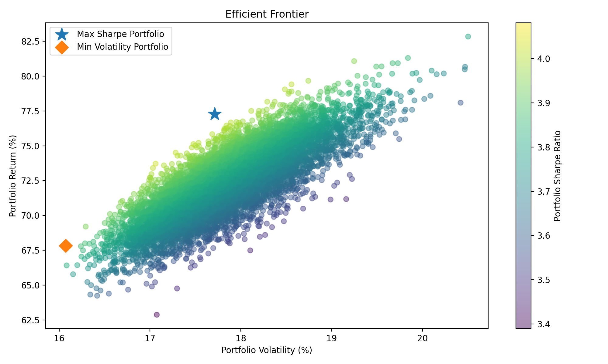
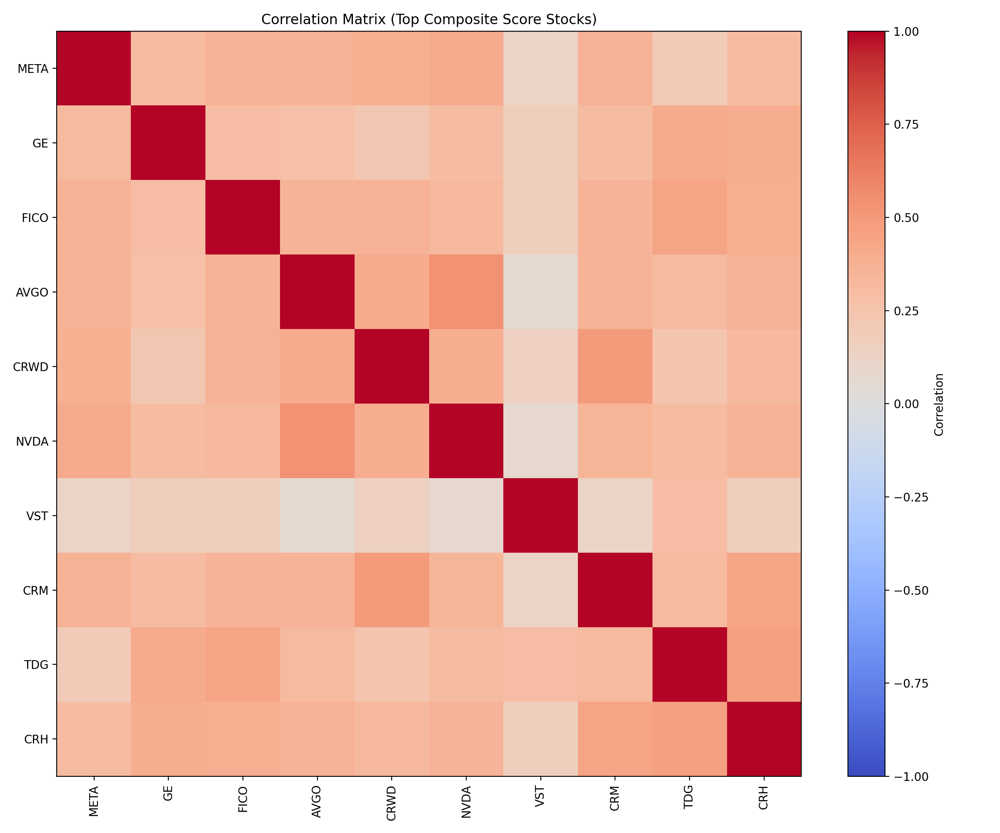
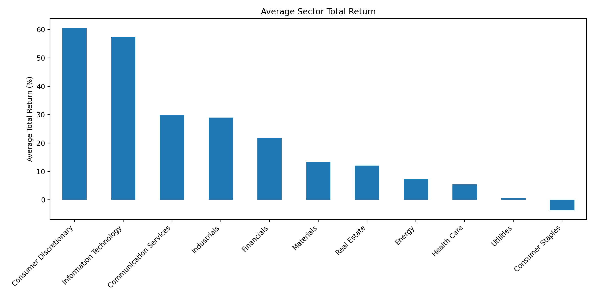
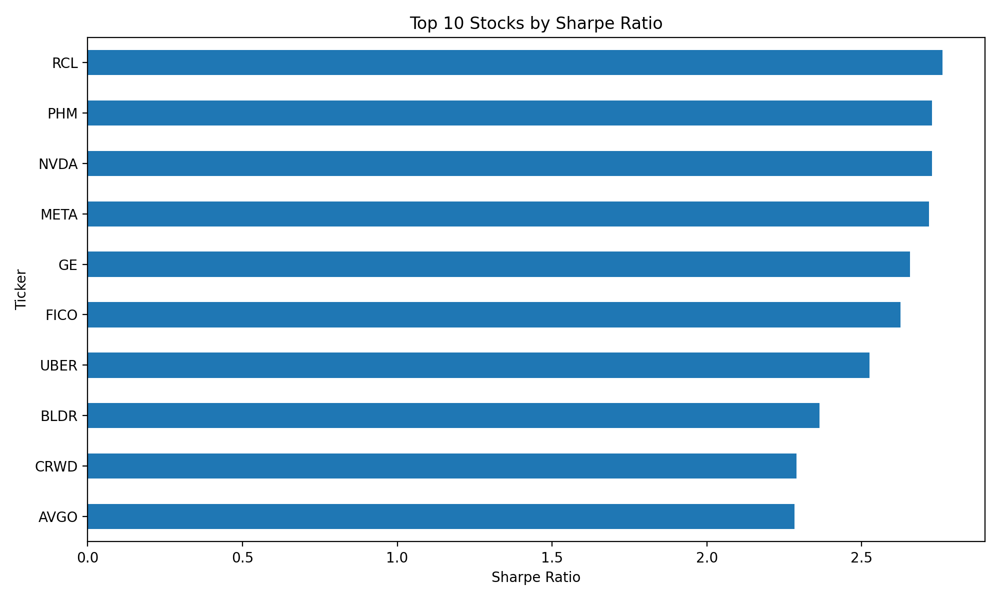

# S&P 500 Stock Screening & Portfolio Optimization System

This project analyzes S&P 500 stocks using Python and quantitative finance techniques.
It collects historical market data, calculates risk and performance metrics, screens stocks based on multiple factors, and constructs optimized portfolios using Modern Portfolio Theory.

---

## Features

* Download historical S&P 500 stock data using Yahoo Finance
* Calculate key financial metrics:

  * Total Return
  * Volatility
  * Sharpe Ratio
  * Sortino Ratio
  * Alpha
  * Max Drawdown
* Perform sector performance analysis
* Generate correlation matrix for diversification insights
* Build a multi-factor stock screening model
* Perform portfolio optimization using Efficient Frontier simulation
* Identify Maximum Sharpe and Minimum Volatility portfolios

---

## Technologies Used

* Python
* Pandas
* NumPy
* Matplotlib
* Seaborn
* Yahoo Finance API
* SciPy

---

## Example Visualizations

### Efficient Frontier



### Correlation Heatmap



### Sector Average Total Return



### Top 10 Stocks by Sharpe Ratio



---

## Installation

Clone the repository:

```
git clone https://github.com/elnurqurb4nov/sp500-stock-screening-portfolio-optimization.git
```

Install required packages:

```
pip install -r requirements.txt
```

Run the analysis script:

```
python stock_screener.py
```

---

## Project Structure

```
sp500-stock-screening-portfolio-optimization

plots/
README.md
requirements.txt
stock_screener.py
summary_report.txt
```

---

## Author

Elnur Gurbanzade

Master's Student – Business Finance
Riga Technical University
